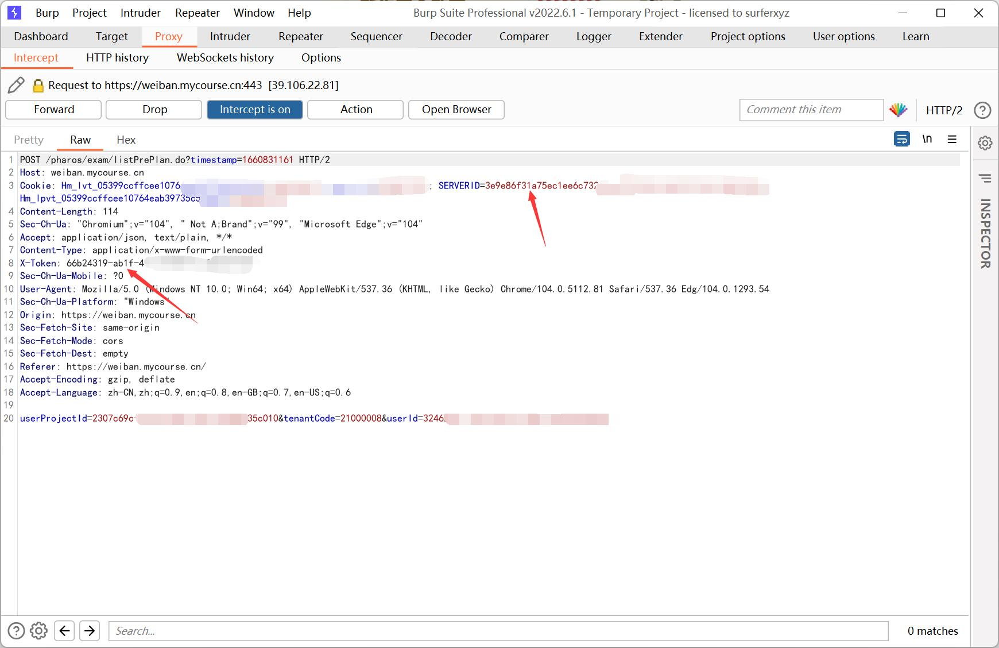

# 2022_Safety_Education_Auto
*南京邮电大学 2022 新生安全教育自动化脚本*

程序默认只完成 "2022级新生安全教育" 部分的内容, 若想完成其它课程可自行抓包更改 `userProjectId` 的值

每个请求之间默认间隔 30s (小于 30s 的可行性尚未测试)

## Requriements

Python 3+

httpx

```bash
pip3 install httpx
```

## Usage

使用前请打开 auto.py, 更改以下两项的值

```python
COOKIE_SERVERID = 'YOUR_COOKIE'

X_TOKEN = 'X_TOKEN'
```

获取方法见下图



或者用 F12 开发者工具, 在 "网络" 一栏中查看
